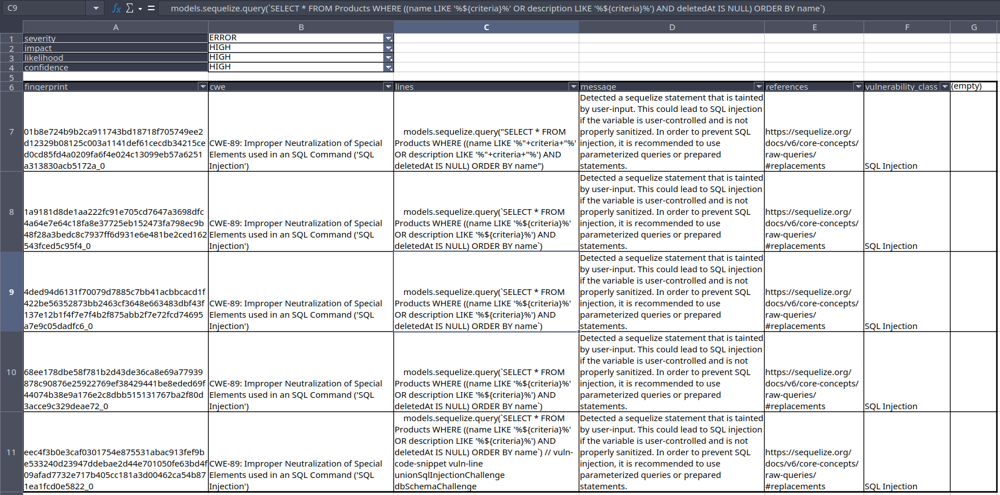

# OWASP Juice Shop

## Checklist

### Отчёт должен иметь следующую структуру:

- [ ] Введение — описание приложения.
- [x] Результаты статического анализа — общие, можно без детализации.
- [x] Уязвимости из OWASP Top-10, обнаруженные в результате статического анализа, — минимум пять штук.
- [ ] Демонстрация эксплуатации трёх уязвимостей из OWASP Top-10 — скриншоты эксплуатации, проведённой с помощью инструмента Burp Suite. Выбор этих уязвимостей остаётся на ваше усмотрение.
- [ ] Рекомендации по устранению к трём продемонстрированным уязвимостям — можно взять основу с сайта MITRE ATT&CK под найденные CWE.

### В отчёте обязательно должны присутствовать:

- [x] Скриншоты (минимум два) или [выгрузка результатов статического сканирования](./results-top10owasp-semgrep.json) в пункте 2.
- [ ] Список уязвимостей из OWASP Top-10 с доказательствами в пункте 3 (в виде скриншотов, найденных анализатором уязвимостей; отдельно от остальных уязвимостей).
- [ ] Скриншоты из Burp Suite в пункте 4, а также обязательно текстовое описание эксплуатации: что необходимо сделать, чтобы воспроизвести уязвимость.

### Tools:

- [ ] semgrep login
- [ ] burp suite community

## Report

### Intro - app description

TODO

### SAST analysis via SemGrep

install semgrep
```bash
pipx install semgrep
```

clone juice code
```bash
git clone git@github.com:juice-shop/juice-shop.git
cd juice-shop
```

#### [First scan](./results-semgrep.json) ------------------------------

```bash
semgrep scan --config=auto --json -o results-semgrep.json
```

<details>

<summary>first scan, figuring out how does it work</summary>

check
```bash
cat results-semgrep.json | jq . | vim -
```

high level, keys
``` bash
cat results-semgrep.json | jq 'keys[]'
```

```
"errors"
"interfile_languages_used"
"paths"
"results"
"skipped_rules"
"version"
```

example error

``` bash
cat results-semgrep.json | jq '.errors[31]'
```

```json
{
  "code": 2,
  "level": "warn",
  "message": "Timeout when running javascript.lang.security.insecure-object-assign.insecure-object-assign on frontend/src/assets/private/three.js:\n ",
  "path": "frontend/src/assets/private/three.js",
  "rule_id": "javascript.lang.security.insecure-object-assign.insecure-object-assign",
  "type": "Timeout"
}
```

example result

```bash
cat results-semgrep.json | jq '.results[65]'
```

```json
{
  "check_id": "javascript.express.security.audit.xss.pug.explicit-unescape.template-explicit-unescape",
  "end": {
    "col": 40,
    "line": 79,
    "offset": 3969
  },
  "extra": {
    "engine_kind": "OSS",
    "fingerprint": "a15f585b68d6d123be356ae999949a88694dcee167c404b60d277df0ecb69aceaa54652bb72451e4c0cd5b1e6152730adc6dc1c6487ae2b3dc443410f1188dc4_0",
    "is_ignored": false,
    "lines": "            if (splitted.length != 2) {",
    "message": "Detected an explicit unescape in a Pug template, using either '!=' or '!{...}'. If external data can reach these locations, your application is exposed to a cross-site scripting (XSS) vulnerability. If you must do this, ensure no external data can reach this location.",
    "metadata": {
      "category": "security",
      "confidence": "LOW",
      "cwe": [
        "CWE-79: Improper Neutralization of Input During Web Page Generation ('Cross-site Scripting')"
      ],
      "cwe2021-top25": true,
      "cwe2022-top25": true,
      "impact": "MEDIUM",
      "license": "Commons Clause License Condition v1.0[LGPL-2.1-only]",
      "likelihood": "LOW",
      "owasp": [
        "A07:2017 - Cross-Site Scripting (XSS)",
        "A03:2021 - Injection"
      ],
      "references": [
        "https://pugjs.org/language/code.html#unescaped-buffered-code",
        "https://pugjs.org/language/attributes.html#unescaped-attributes"
      ],
      "semgrep.dev": {
        "rule": {
          "origin": "community",
          "r_id": 9287,
          "rule_id": "WAUonl",
          "rv_id": 834091,
          "url": "https://semgrep.dev/playground/r/ZRTlPA9/javascript.express.security.audit.xss.pug.explicit-unescape.template-explicit-unescape",
          "version_id": "ZRTlPA9"
        }
      },
      "shortlink": "https://sg.run/3xbe",
      "source": "https://semgrep.dev/r/javascript.express.security.audit.xss.pug.explicit-unescape.template-explicit-unescape",
      "subcategory": [
        "audit"
      ],
      "technology": [
        "express"
      ],
      "vulnerability_class": [
        "Cross-Site-Scripting (XSS)"
      ]
    },
    "metavars": {
      "$1": {
        "abstract_content": "!=",
        "end": {
          "col": 35,
          "line": 79,
          "offset": 3964
        },
        "start": {
          "col": 33,
          "line": 79,
          "offset": 3962
        }
      }
    },
    "severity": "WARNING",
    "validation_state": "NO_VALIDATOR"
  },
  "path": "views/promotionVideo.pug",
  "start": {
    "col": 13,
    "line": 79,
    "offset": 3942
  }
}
```

</details>

#### [Second scan](./results-top10owasp-semgrep.json) - owasp top 10 ------------------------------

``` bash
semgrep --config "p/owasp-top-ten" --json -o results-top10owasp-semgrep.json
```

<details>
<summary>example result</summary>

``` bash
cat results-top10owasp-semgrep.json | jq '.results[28]'
```

``` json
{
  "check_id": "javascript.express.security.audit.express-check-directory-listing.express-check-directory-listing",
  "end": {
    "col": 103,
    "line": 272,
    "offset": 12297
  },
  "extra": {
    "engine_kind": "OSS",
    "fingerprint": "c2c7cc5931e16da7a7bc9e2fc1e98093f4c2df0159cda8677f10cd4747a7e125dbcf1faf73b825dc6d1908c737a9c354fc272b9f0bb4f3620c4a5909de3fd6be_3",
    "is_ignored": false,
    "lines": "  app.use('/support/logs', serveIndexMiddleware, serveIndex('logs', { icons: true, view: 'details' })) // vuln-code-snippet vuln-line accessLogDisclosureChallenge",
    "message": "Directory listing/indexing is enabled, which may lead to disclosure of sensitive directories and files. It is recommended to disable directory listing unless it is a public resource. If you need directory listing, ensure that sensitive files are inaccessible when querying the resource.",
    "metadata": {
      "category": "security",
      "confidence": "MEDIUM",
      "cwe": [
        "CWE-548: Exposure of Information Through Directory Listing"
      ],
      "impact": "MEDIUM",
      "interfile": true,
      "license": "Commons Clause License Condition v1.0[LGPL-2.1-only]",
      "likelihood": "HIGH",
      "owasp": [
        "A06:2017 - Security Misconfiguration",
        "A01:2021 - Broken Access Control"
      ],
      "references": [
        "https://www.npmjs.com/package/serve-index",
        "https://www.acunetix.com/blog/articles/directory-listing-information-disclosure/"
      ],
      "semgrep.dev": {
        "rule": {
          "origin": "community",
          "r_id": 22552,
          "rule_id": "x8UqEb",
          "rv_id": 834060,
          "url": "https://semgrep.dev/playground/r/GxTDEXG/javascript.express.security.audit.express-check-directory-listing.express-check-directory-listing",
          "version_id": "GxTDEXG"
        }
      },
      "shortlink": "https://sg.run/DX2G",
      "source": "https://semgrep.dev/r/javascript.express.security.audit.express-check-directory-listing.express-check-directory-listing",
      "subcategory": [
        "vuln"
      ],
      "technology": [
        "express"
      ],
      "vulnerability_class": [
        "Mishandled Sensitive Information"
      ]
    },
    "metavars": {
      "$APP": {
        "abstract_content": "app",
        "end": {
          "col": 6,
          "line": 272,
          "offset": 12200
        },
        "propagated_value": {
          "svalue_abstract_content": "express()",
          "svalue_end": {
            "col": 22,
            "line": 105,
            "offset": 4885
          },
          "svalue_start": {
            "col": 13,
            "line": 105,
            "offset": 4876
          }
        },
        "start": {
          "col": 3,
          "line": 272,
          "offset": 12197
        }
      },
      "$SERVEINDEX": {
        "abstract_content": "serveIndex",
        "end": {
          "col": 60,
          "line": 272,
          "offset": 12254
        },
        "start": {
          "col": 50,
          "line": 272,
          "offset": 12244
        }
      }
    },
    "severity": "WARNING",
    "validation_state": "NO_VALIDATOR"
  },
  "path": "server.ts",
  "start": {
    "col": 3,
    "line": 272,
    "offset": 12197
  }
}
```

viewing result's keys
``` bash
cat results-semgrep.json | jq '.results[65] | keys[]'
```

``` json
"check_id"
"end"
"extra"
"path"
"start"
```

</details>

converting to csv (using [flatten.py](./flatten.py))
``` python
import json
from pprint import pprint

import pandas as pd
from flatten import flatten

with open("./results-top10owasp-semgrep.json", "r") as f:
    semgrep = json.load(f)

semgrep_results_flatten = [flatten(r) for r in semgrep["results"]]
flattenier = []
for r in semgrep_results_flatten:
    flattenier += r

df = pd.DataFrame(flattenier)
df.to_csv("./results-top10owasp-semgrep.csv", index=False)

# pprint(df.T[19])
```

[./results-top10owasp-semgrep.csv](./results-top10owasp-semgrep.csv)

transposed version
``` python
from pprint import pprint
import pandas as pd

df = pd.read_csv("./results-top10owasp-semgrep.csv")
df.T.to_csv("./results-top10owasp-semgrep-transposed.csv")

pprint(df.T[19].to_dict())
```

<details>
<summary>example single record in flatten form</summary>

``` json
{'check_id': 'javascript.express.security.injection.tainted-sql-string.tainted-sql-string',
 'end.col': 82,
 'end.line': 5,
 'end.offset': 348,
 'extra.dataflow_trace.intermediate_vars.content': 'criteria',
 'extra.dataflow_trace.intermediate_vars.location.end.col': 17.0,
 'extra.dataflow_trace.intermediate_vars.location.end.line': 3.0,
 'extra.dataflow_trace.intermediate_vars.location.end.offset': 126.0,
 'extra.dataflow_trace.intermediate_vars.location.path': 'data/static/codefixes/dbSchemaChallenge_1.ts',
 'extra.dataflow_trace.intermediate_vars.location.start.col': 9.0,
 'extra.dataflow_trace.intermediate_vars.location.start.line': 3.0,
 'extra.dataflow_trace.intermediate_vars.location.start.offset': 118.0,
 'extra.dataflow_trace.taint_sink.': 'CliLoc',
 'extra.dataflow_trace.taint_sink..': nan,
 'extra.dataflow_trace.taint_sink..end.col': nan,
 'extra.dataflow_trace.taint_sink..end.line': nan,
 'extra.dataflow_trace.taint_sink..end.offset': nan,
 'extra.dataflow_trace.taint_sink..path': nan,
 'extra.dataflow_trace.taint_sink..start.col': nan,
 'extra.dataflow_trace.taint_sink..start.line': nan,
 'extra.dataflow_trace.taint_sink..start.offset': nan,
 'extra.dataflow_trace.taint_source.': 'CliLoc',
 'extra.dataflow_trace.taint_source..': nan,
 'extra.dataflow_trace.taint_source..end.col': nan,
 'extra.dataflow_trace.taint_source..end.line': nan,
 'extra.dataflow_trace.taint_source..end.offset': nan,
 'extra.dataflow_trace.taint_source..path': nan,
 'extra.dataflow_trace.taint_source..start.col': nan,
 'extra.dataflow_trace.taint_source..start.line': nan,
 'extra.dataflow_trace.taint_source..start.offset': nan,
 'extra.engine_kind': 'OSS',
 'extra.fingerprint': 'cc6f8a73fe7044cae8b8433c0c5ea2d175f47c90ad6f73a0b0c1e4e9b36069756742671c2d5662a9bf010184c7c773a19bad45b329e39da7b6eaaab6d9a19f11_0',
 'extra.is_ignored': False,
 'extra.lines': '    models.sequelize.query("SELECT * FROM Products WHERE '
                '((name LIKE \'%"+criteria+"%\' OR description LIKE '
                '\'%"+criteria+"%\') AND deletedAt IS NULL) ORDER BY name")',
 'extra.message': 'Detected user input used to manually construct a SQL '
                  'string. This is usually bad practice because manual '
                  'construction could accidentally result in a SQL injection. '
                  'An attacker could use a SQL injection to steal or modify '
                  'contents of the database. Instead, use a parameterized '
                  'query which is available by default in most database '
                  'engines. Alternatively, consider using an object-relational '
                  'mapper (ORM) such as Sequelize which will protect your '
                  'queries.',
 'extra.metadata.asvs.control_id': nan,
 'extra.metadata.asvs.control_url': nan,
 'extra.metadata.asvs.section': nan,
 'extra.metadata.asvs.version': nan,
 'extra.metadata.category': 'security',
 'extra.metadata.confidence': 'MEDIUM',
 'extra.metadata.cwe.': 'CWE-89: Improper Neutralization of Special Elements '
                        "used in an SQL Command ('SQL Injection')",
 'extra.metadata.cwe2021-top25': True,
 'extra.metadata.cwe2022-top25': True,
 'extra.metadata.impact': 'MEDIUM',
 'extra.metadata.interfile': nan,
 'extra.metadata.license': 'Commons Clause License Condition '
                           'v1.0[LGPL-2.1-only]',
 'extra.metadata.likelihood': 'HIGH',
 'extra.metadata.owasp.': 'A03:2021 - Injection',
 'extra.metadata.references.': 'https://owasp.org/www-community/attacks/SQL_Injection',
 'extra.metadata.semgrep.dev.rule.origin': 'community',
 'extra.metadata.semgrep.dev.rule.r_id': 14715,
 'extra.metadata.semgrep.dev.rule.rule_id': 'NbUNpr',
 'extra.metadata.semgrep.dev.rule.rv_id': 834108,
 'extra.metadata.semgrep.dev.rule.url': 'https://semgrep.dev/playground/r/DkTG0jd/javascript.express.security.injection.tainted-sql-string.tainted-sql-string',
 'extra.metadata.semgrep.dev.rule.version_id': 'DkTG0jd',
 'extra.metadata.shortlink': 'https://sg.run/66ZL',
 'extra.metadata.source': 'https://semgrep.dev/r/javascript.express.security.injection.tainted-sql-string.tainted-sql-string',
 'extra.metadata.source_rule_url.': nan,
 'extra.metadata.subcategory.': 'vuln',
 'extra.metadata.technology.': 'express',
 'extra.metadata.vulnerability_class.': 'SQL Injection',
 'extra.metavars.$1.abstract_content': 'SELECT',
 'extra.metavars.$1.end.col': 7.0,
 'extra.metavars.$1.end.line': 1.0,
 'extra.metavars.$1.end.offset': 6.0,
 'extra.metavars.$1.start.col': 1.0,
 'extra.metavars.$1.start.line': 1.0,
 'extra.metavars.$1.start.offset': 0.0,
 'extra.metavars.$APP.abstract_content': nan,
 'extra.metavars.$APP.end.col': nan,
 'extra.metavars.$APP.end.line': nan,
 'extra.metavars.$APP.end.offset': nan,
 'extra.metavars.$APP.propagated_value.svalue_abstract_content': nan,
 'extra.metavars.$APP.propagated_value.svalue_end.col': nan,
 'extra.metavars.$APP.propagated_value.svalue_end.line': nan,
 'extra.metavars.$APP.propagated_value.svalue_end.offset': nan,
 'extra.metavars.$APP.propagated_value.svalue_start.col': nan,
 'extra.metavars.$APP.propagated_value.svalue_start.line': nan,
 'extra.metavars.$APP.propagated_value.svalue_start.offset': nan,
 'extra.metavars.$APP.start.col': nan,
 'extra.metavars.$APP.start.line': nan,
 'extra.metavars.$APP.start.offset': nan,
 'extra.metavars.$ASSIGN.abstract_content': nan,
 'extra.metavars.$ASSIGN.end.col': nan,
 'extra.metavars.$ASSIGN.end.line': nan,
 'extra.metavars.$ASSIGN.end.offset': nan,
 'extra.metavars.$ASSIGN.propagated_value.svalue_abstract_content': nan,
 'extra.metavars.$ASSIGN.propagated_value.svalue_end.col': nan,
 'extra.metavars.$ASSIGN.propagated_value.svalue_end.line': nan,
 'extra.metavars.$ASSIGN.propagated_value.svalue_end.offset': nan,
 'extra.metavars.$ASSIGN.propagated_value.svalue_start.col': nan,
 'extra.metavars.$ASSIGN.propagated_value.svalue_start.line': nan,
 'extra.metavars.$ASSIGN.propagated_value.svalue_start.offset': nan,
 'extra.metavars.$ASSIGN.start.col': nan,
 'extra.metavars.$ASSIGN.start.line': nan,
 'extra.metavars.$ASSIGN.start.offset': nan,
 'extra.metavars.$DATA.abstract_content': nan,
 'extra.metavars.$DATA.end.col': nan,
 'extra.metavars.$DATA.end.line': nan,
 'extra.metavars.$DATA.end.offset': nan,
 'extra.metavars.$DATA.start.col': nan,
 'extra.metavars.$DATA.start.line': nan,
 'extra.metavars.$DATA.start.offset': nan,
 'extra.metavars.$DB.abstract_content': nan,
 'extra.metavars.$DB.end.col': nan,
 'extra.metavars.$DB.end.line': nan,
 'extra.metavars.$DB.end.offset': nan,
 'extra.metavars.$DB.start.col': nan,
 'extra.metavars.$DB.start.line': nan,
 'extra.metavars.$DB.start.offset': nan,
 'extra.metavars.$EXPR.abstract_content': 'criteria',
 'extra.metavars.$EXPR.end.col': 82.0,
 'extra.metavars.$EXPR.end.line': 5.0,
 'extra.metavars.$EXPR.end.offset': 348.0,
 'extra.metavars.$EXPR.start.col': 74.0,
 'extra.metavars.$EXPR.start.line': 5.0,
 'extra.metavars.$EXPR.start.offset': 340.0,
 'extra.metavars.$JWT.abstract_content': nan,
 'extra.metavars.$JWT.end.col': nan,
 'extra.metavars.$JWT.end.line': nan,
 'extra.metavars.$JWT.end.offset': nan,
 'extra.metavars.$JWT.start.col': nan,
 'extra.metavars.$JWT.start.line': nan,
 'extra.metavars.$JWT.start.offset': nan,
 'extra.metavars.$METH.abstract_content': nan,
 'extra.metavars.$METH.end.col': nan,
 'extra.metavars.$METH.end.line': nan,
 'extra.metavars.$METH.end.offset': nan,
 'extra.metavars.$METH.start.col': nan,
 'extra.metavars.$METH.start.line': nan,
 'extra.metavars.$METH.start.offset': nan,
 'extra.metavars.$METHOD.abstract_content': nan,
 'extra.metavars.$METHOD.end.col': nan,
 'extra.metavars.$METHOD.end.line': nan,
 'extra.metavars.$METHOD.end.offset': nan,
 'extra.metavars.$METHOD.start.col': nan,
 'extra.metavars.$METHOD.start.line': nan,
 'extra.metavars.$METHOD.start.offset': nan,
 'extra.metavars.$NEXT.abstract_content': nan,
 'extra.metavars.$NEXT.end.col': nan,
 'extra.metavars.$NEXT.end.line': nan,
 'extra.metavars.$NEXT.end.offset': nan,
 'extra.metavars.$NEXT.start.col': nan,
 'extra.metavars.$NEXT.start.line': nan,
 'extra.metavars.$NEXT.start.offset': nan,
 'extra.metavars.$PUG.abstract_content': nan,
 'extra.metavars.$PUG.end.col': nan,
 'extra.metavars.$PUG.end.line': nan,
 'extra.metavars.$PUG.end.offset': nan,
 'extra.metavars.$PUG.start.col': nan,
 'extra.metavars.$PUG.start.line': nan,
 'extra.metavars.$PUG.start.offset': nan,
 'extra.metavars.$QUERY.abstract_content': nan,
 'extra.metavars.$QUERY.end.col': nan,
 'extra.metavars.$QUERY.end.line': nan,
 'extra.metavars.$QUERY.end.offset': nan,
 'extra.metavars.$QUERY.start.col': nan,
 'extra.metavars.$QUERY.start.line': nan,
 'extra.metavars.$QUERY.start.offset': nan,
 'extra.metavars.$REQ.abstract_content': 'req',
 'extra.metavars.$REQ.end.col': 63.0,
 'extra.metavars.$REQ.end.line': 3.0,
 'extra.metavars.$REQ.end.offset': 172.0,
 'extra.metavars.$REQ.start.col': 60.0,
 'extra.metavars.$REQ.start.line': 3.0,
 'extra.metavars.$REQ.start.offset': 169.0,
 'extra.metavars.$REQUEST.abstract_content': nan,
 'extra.metavars.$REQUEST.end.col': nan,
 'extra.metavars.$REQUEST.end.line': nan,
 'extra.metavars.$REQUEST.end.offset': nan,
 'extra.metavars.$REQUEST.start.col': nan,
 'extra.metavars.$REQUEST.start.line': nan,
 'extra.metavars.$REQUEST.start.offset': nan,
 'extra.metavars.$RES.abstract_content': nan,
 'extra.metavars.$RES.end.col': nan,
 'extra.metavars.$RES.end.line': nan,
 'extra.metavars.$RES.end.offset': nan,
 'extra.metavars.$RES.start.col': nan,
 'extra.metavars.$RES.start.line': nan,
 'extra.metavars.$RES.start.offset': nan,
 'extra.metavars.$SERVEINDEX.abstract_content': nan,
 'extra.metavars.$SERVEINDEX.end.col': nan,
 'extra.metavars.$SERVEINDEX.end.line': nan,
 'extra.metavars.$SERVEINDEX.end.offset': nan,
 'extra.metavars.$SERVEINDEX.start.col': nan,
 'extra.metavars.$SERVEINDEX.start.line': nan,
 'extra.metavars.$SERVEINDEX.start.offset': nan,
 'extra.metavars.$SINK.abstract_content': nan,
 'extra.metavars.$SINK.end.col': nan,
 'extra.metavars.$SINK.end.line': nan,
 'extra.metavars.$SINK.end.offset': nan,
 'extra.metavars.$SINK.propagated_value.svalue_abstract_content': nan,
 'extra.metavars.$SINK.propagated_value.svalue_end.col': nan,
 'extra.metavars.$SINK.propagated_value.svalue_end.line': nan,
 'extra.metavars.$SINK.propagated_value.svalue_end.offset': nan,
 'extra.metavars.$SINK.propagated_value.svalue_start.col': nan,
 'extra.metavars.$SINK.propagated_value.svalue_start.line': nan,
 'extra.metavars.$SINK.propagated_value.svalue_start.offset': nan,
 'extra.metavars.$SINK.start.col': nan,
 'extra.metavars.$SINK.start.line': nan,
 'extra.metavars.$SINK.start.offset': nan,
 'extra.metavars.$SQLSTR.abstract_content': 'SELECT * FROM Products WHERE '
                                            "((name LIKE '%",
 'extra.metavars.$SQLSTR.end.col': 72.0,
 'extra.metavars.$SQLSTR.end.line': 5.0,
 'extra.metavars.$SQLSTR.end.offset': 338.0,
 'extra.metavars.$SQLSTR.start.col': 29.0,
 'extra.metavars.$SQLSTR.start.line': 5.0,
 'extra.metavars.$SQLSTR.start.offset': 295.0,
 'extra.metavars.$VALUE.abstract_content': nan,
 'extra.metavars.$VALUE.end.col': nan,
 'extra.metavars.$VALUE.end.line': nan,
 'extra.metavars.$VALUE.end.offset': nan,
 'extra.metavars.$VALUE.propagated_value.svalue_abstract_content': nan,
 'extra.metavars.$VALUE.propagated_value.svalue_end.col': nan,
 'extra.metavars.$VALUE.propagated_value.svalue_end.line': nan,
 'extra.metavars.$VALUE.propagated_value.svalue_end.offset': nan,
 'extra.metavars.$VALUE.propagated_value.svalue_start.col': nan,
 'extra.metavars.$VALUE.propagated_value.svalue_start.line': nan,
 'extra.metavars.$VALUE.propagated_value.svalue_start.offset': nan,
 'extra.metavars.$VALUE.start.col': nan,
 'extra.metavars.$VALUE.start.line': nan,
 'extra.metavars.$VALUE.start.offset': nan,
 'extra.metavars.$X.abstract_content': nan,
 'extra.metavars.$X.end.col': nan,
 'extra.metavars.$X.end.line': nan,
 'extra.metavars.$X.end.offset': nan,
 'extra.metavars.$X.start.col': nan,
 'extra.metavars.$X.start.line': nan,
 'extra.metavars.$X.start.offset': nan,
 'extra.metavars.$Y.abstract_content': nan,
 'extra.metavars.$Y.end.col': nan,
 'extra.metavars.$Y.end.line': nan,
 'extra.metavars.$Y.end.offset': nan,
 'extra.metavars.$Y.start.col': nan,
 'extra.metavars.$Y.start.line': nan,
 'extra.metavars.$Y.start.offset': nan,
 'extra.severity': 'ERROR',
 'extra.validation_state': 'NO_VALIDATOR',
 'path': 'data/static/codefixes/dbSchemaChallenge_1.ts',
 'start.col': 74,
 'start.line': 5,
 'start.offset': 340}
```

</details>

[./results-top10owasp-semgrep-transposed.csv](./results-top10owasp-semgrep-transposed.csv)

filtering cols

``` python
from pprint import pprint
import pandas as pd

df = pd.read_csv("./results-top10owasp-semgrep.csv")

cols_to_save = {
    'check_id': 'check_id',
    'extra.dataflow_trace.intermediate_vars.location.path': 'location.path',
    'extra.fingerprint': 'fingerprint',
    'extra.is_ignored': 'is_ignored',
    'extra.lines': 'lines',
    'extra.message': 'message',
    'extra.metadata.category': 'category',
    'extra.metadata.confidence': 'confidence',
    'extra.metadata.impact': 'impact',
    'extra.metadata.likelihood': 'likelihood',
    'extra.severity': 'severity',
    'extra.validation_state':  'validation_state',
    'extra.metadata.license': 'license',
    'extra.metadata.cwe.': 'cwe',
    'extra.metadata.owasp.': "owasp",
    'extra.metadata.references.': 'references',
    'extra.metadata.semgrep.dev.rule.url': 'semgrep.dev.rule.url',
    'extra.metadata.vulnerability_class.': 'vulnerability_class',
    'extra.metavars.$1.abstract_content': 'abstract_content_1',
    'extra.metavars.$SQLSTR.abstract_content': 'sql_str',
}

df.rename(columns=cols_to_save, inplace=True)
df[cols_to_save.values()].to_csv("./results-top10owasp-semgrep-compact.csv", index=False)
df[cols_to_save.values()].to_excel("./results-top10owasp-semgrep-compact.xlsx", index=False)
```

[./results-top10owasp-semgrep-compact.csv](./results-top10owasp-semgrep-compact.csv)

#### 5 most severe findings with highest likelihood and confidence:**

[./results-top10owasp-semgrep-compact.xlsx](./results-top10owasp-semgrep-compact.xlsx)



### DAST with Burp Suite

TODO

### Recommendations

TODO
